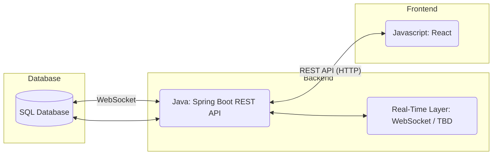
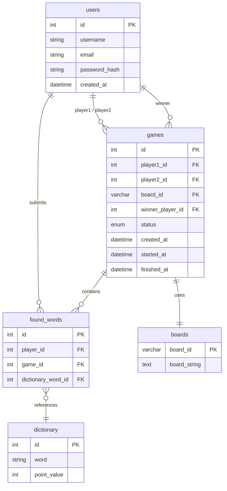
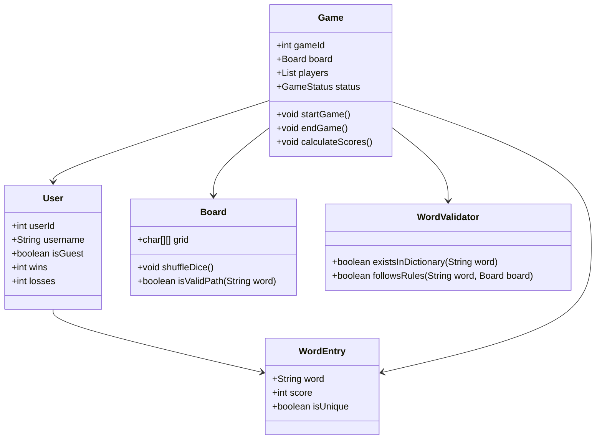
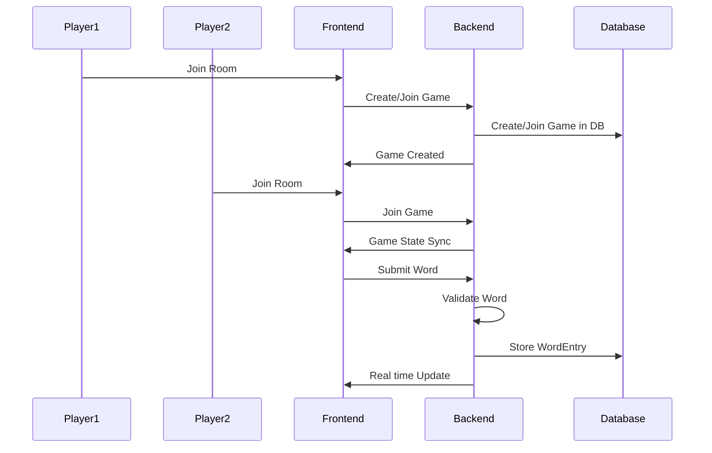

# Specification Document

## Boggle Buddies

### Project Abstract

**Boggle Buddies** is a real time multiplayer word game inspired by the classic game **Boggle**, where players compete to find as many valid words as possible from a randomly generated letter board within a time limit. The application features both <u>live multiplayer matches</u> and a <u>player vs computer mode</u>. Users are able to play as a *guest* or *create an account* to track long term stats like wins and losses. The system includes *board shuffling algorithms*, *dictionary-based validation*, *rule enforcement* like no duplicate words, and a *dynamic scoring screen* that highlights unique vs shared words. This is built with a **React** frontend and a **Java Spring Boot** backend that allows *settings customization*, *real time game sync*, and *persistent data storage* using a **SQL** database and is containerized using **Docker** for consistency. 

### Customer

The general customer for **Boggle Buddies** includes casual word game players, students, and competitive players who enjoy fast paced vocab challenges, specifically those interested in a real time multiplayer setting. The system is designed for users who value social gameplay, competitive scoring, and a customizable setting in an accessible web environment.

### Specification

#### Technology Stack

#### Database

#### Class Diagram

#### Sequence Diagram

## Features

- Multiplayer gameplay
- Guest and registered user modes
- Random board generation using dice-based shuffling
- Dictionary-based word validation
- Duplicate word prevention
- Score updates during gameplay
- Unique vs shared word highlighting
- Persistent user stats (wins/losses)

## Testing & CI/CD

- Backend testing with JUnit
- Static analysis using PMD
- CI pipeline runs linting and tests on each commit

### Standards & Conventions

<!--This is a link to a seperate coding conventions document / style guide-->
[Style Guide & Conventions](STYLE.md)

---
*Last Updated: Sprint 2*